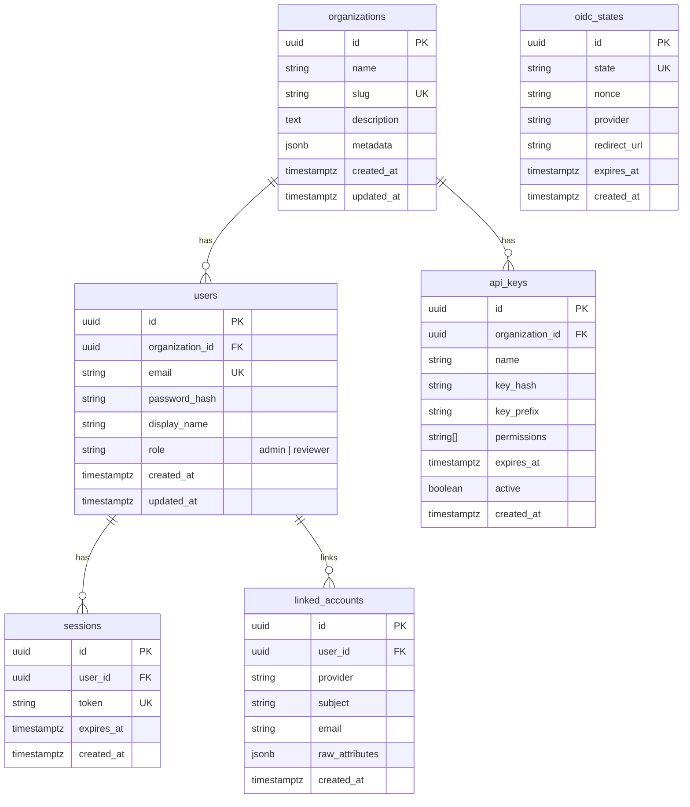
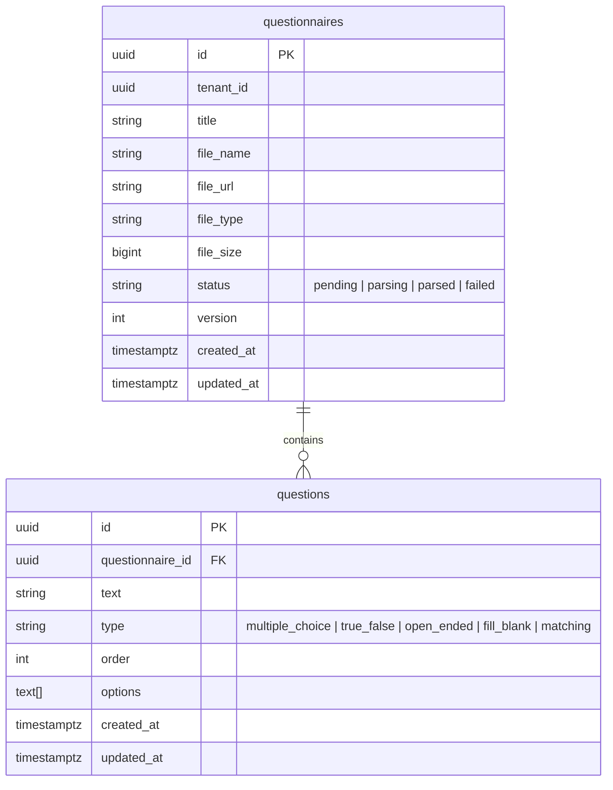
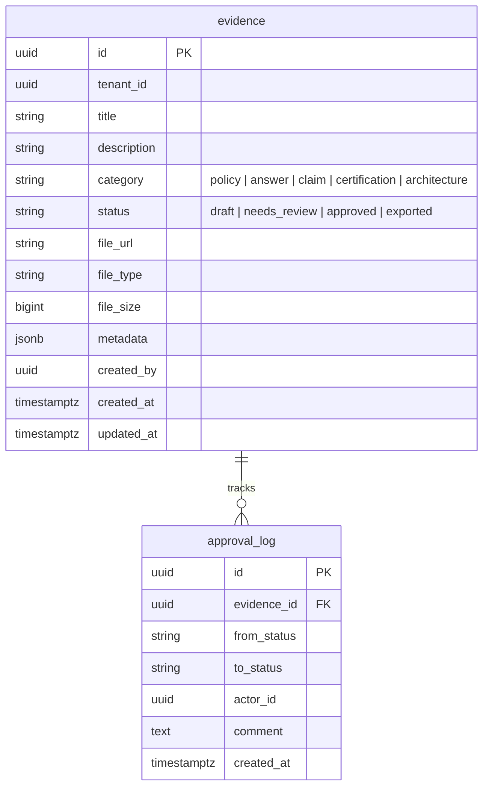
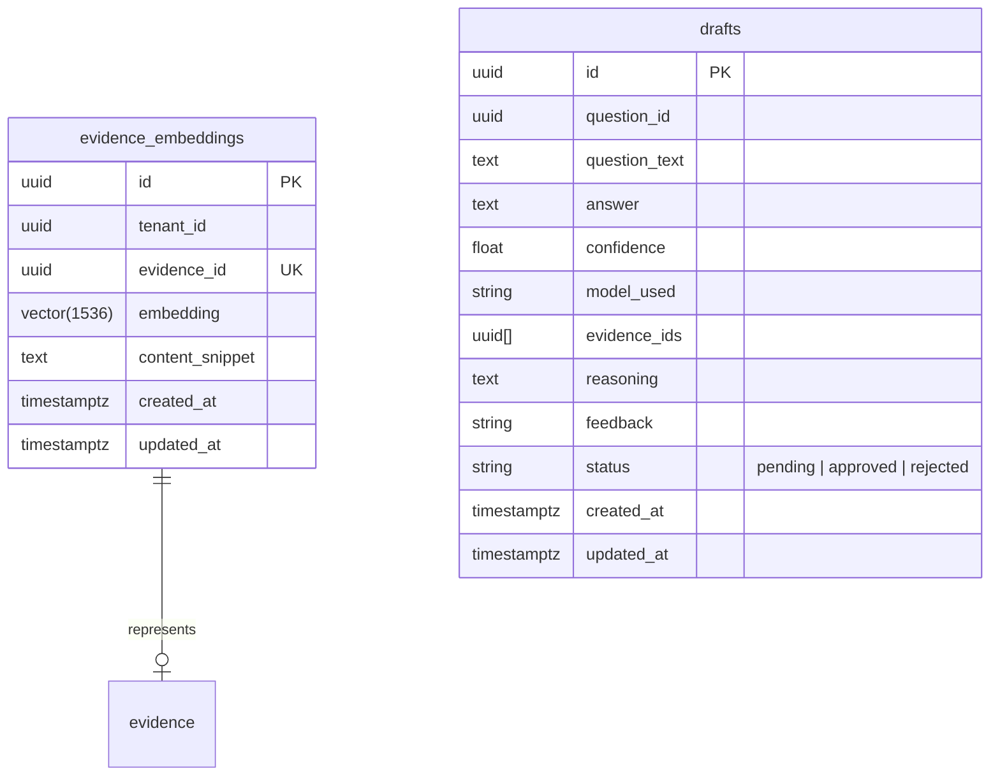
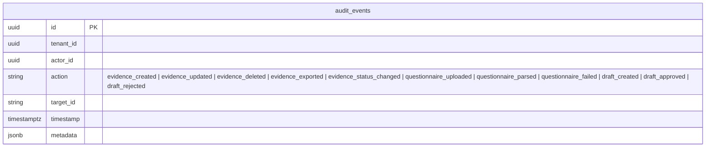
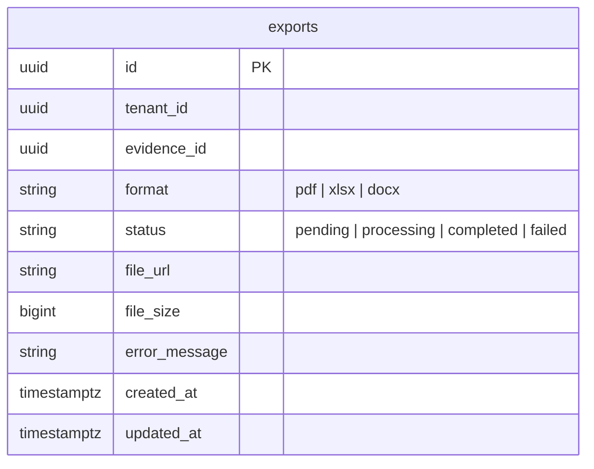
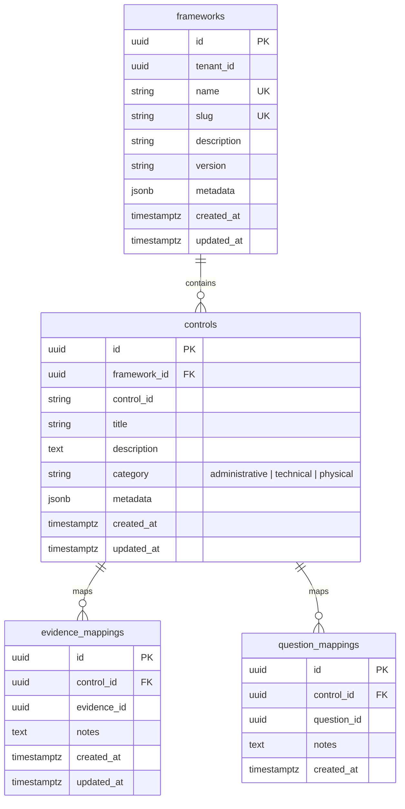

# Database Design

Each service owns an independent PostgreSQL 16 database with isolated schemas. Migrations are managed per-service using [goose](https://github.com/pressly/goose).

## Identity Service (`evidra_identity`)

### Tables



### Indexes
- `users(email)` UNIQUE
- `sessions(token)` UNIQUE
- `api_keys(key_hash)` UNIQUE
- `oidc_states(state)` UNIQUE
- `linked_accounts(provider, subject)` UNIQUE
- `linked_accounts(user_id)` FK

## Questionnaire Service (`evidra_questionnaire`)

### Tables



### Indexes
- `questions(questionnaire_id)` FK

## Evidence Service (`evidra_evidence`)

### Tables



### Indexes
- `evidence(tenant_id, status)` composite
- `evidence(created_by)` FK
- `approval_log(evidence_id)` FK

## Orchestrator Service (`evidra_orchestrator`, requires pgvector)

### Tables



### Indexes
- `evidence_embeddings(tenant_id, evidence_id)` UNIQUE composite
- `evidence_embeddings` pgvector IVFFlat index on `embedding` for cosine similarity search

## Audit Service (`evidra_audit`)

### Tables



### Indexes
- `audit_events(tenant_id, timestamp)` composite (primary query pattern)
- `audit_events(actor_id)` FK filter
- `audit_events(action)` filter
- `audit_events(target_id)` filter

## Export Service (`evidra_export`)

### Tables



### Indexes
- `exports(tenant_id, status)` composite
- `exports(evidence_id)` FK

## Compliance Service (`evidra_compliance`)

### Tables



### Indexes
- `frameworks(tenant_id, slug)` UNIQUE composite
- `controls(framework_id, control_id)` UNIQUE composite
- `evidence_mappings(control_id, evidence_id)` UNIQUE composite
- `question_mappings(control_id, question_id)` UNIQUE composite

## Migration Strategy

Each service has its own migration directory:

```
<service>/repository/migrations/
├── 001_create_organizations.sql
├── 002_create_users.sql
├── 003_create_sessions.sql
├── 004_create_api_keys.sql
├── 005_create_oidc_states.sql
└── 006_create_linked_accounts.sql
```

Run via Makefile:

```bash
make migrate-identity   IDENTITY_DB_URL="..."
make migrate-questionnaire QUESTIONNAIRE_DB_URL="..."
make migrate-evidence   EVIDENCE_DB_URL="..."
make migrate-orchestrator ORCHESTRATOR_DB_URL="..."
make migrate-audit      AUDIT_DB_URL="..."
make migrate-export     EXPORT_DB_URL="..."
make migrate-compliance COMPLIANCE_DB_URL="..."
```

## pgvector Setup

The orchestrator database requires the pgvector extension:

```sql
CREATE EXTENSION IF NOT EXISTS vector;

CREATE INDEX idx_evidence_embeddings_ivfflat
ON evidence_embeddings
USING ivfflat (embedding vector_cosine_ops)
WITH (lists = 100);
```

Vector search query pattern (tenant pre-filter):

```sql
SELECT * FROM evidence_embeddings
WHERE tenant_id = $1
ORDER BY embedding <=> $2
LIMIT $3;
```
